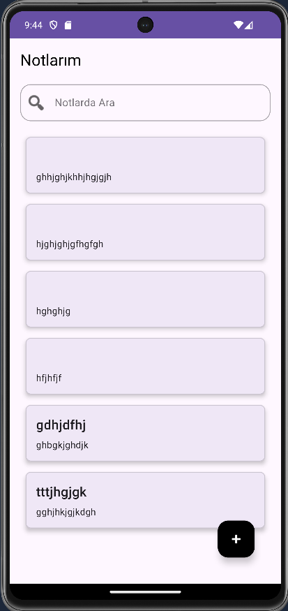
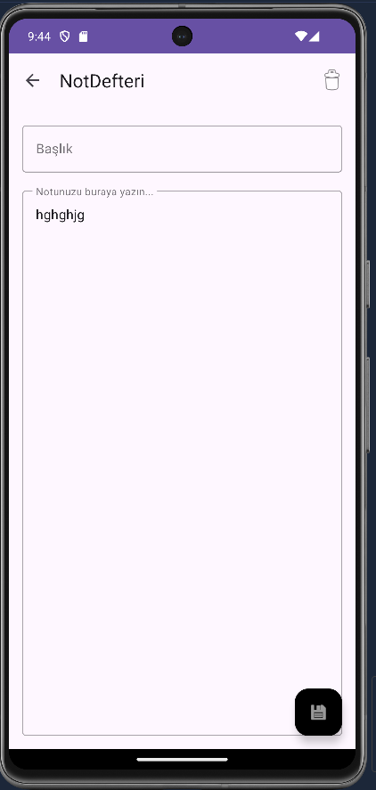

# 📝 Not Defteri Android Uygulaması

Bu proje, kullanıcıların hızlı ve kolay bir şekilde notlar oluşturmasına, düzenlemesine ve silmesine olanak tanıyan basit bir **Android not defteri uygulamasıdır.**  
Kotlin diliyle ve modern Android geliştirme pratikleriyle geliştirilmiştir.

---

## ✨ Özellikler

- 🆕 **Not Oluşturma:** Kullanıcılar yeni notlar ekleyebilir.  
- ✏️ **Not Düzenleme:** Mevcut notların başlığı ve içeriği güncellenebilir.  
- 🗑️ **Not Silme:** Artık ihtiyaç duyulmayan notlar kolayca silinebilir.  
- 💾 **Otomatik Kaydetme:** Geri tuşuna basıldığında veya not detay ekranından çıkıldığında değişiklikler otomatik olarak kaydedilir.  
- 🎨 **Modern Arayüz:** `RecyclerView` ve Material Design bileşenleri ile temiz ve kullanıcı dostu bir arayüz sunar.  
- 🗃️ **Yerel Veri Depolama:** Notlar, cihazın yerel veritabanında (**SQLite**) saklanır.

---

## 📱 Ekran Görüntüleri

| Ana Ekran | Not Detay Ekranı |
|:---:|:---:|
|  |  |

---

## 🛠️ Kullanılan Teknolojiler ve Kütüphaneler

- **Programlama Dili:** Kotlin  
- **Mimari:** Temel **MVVM (Model-View-ViewModel)** prensipleri  
- **Asenkron Programlama:** Kotlin **Coroutines**  
- **Veritabanı:** SQLite  
- **Arayüz Bileşenleri:**
  - AppCompat  
  - Material Components for Android  
  - RecyclerView  
  - ViewBinding  

---

## 🚀 Kurulum ve Çalıştırma

1. Bu depoyu klonlayın:  
   ```bash
   git clone https://github.com/KULLANICI_ADINIZ/NotDefteri.git
